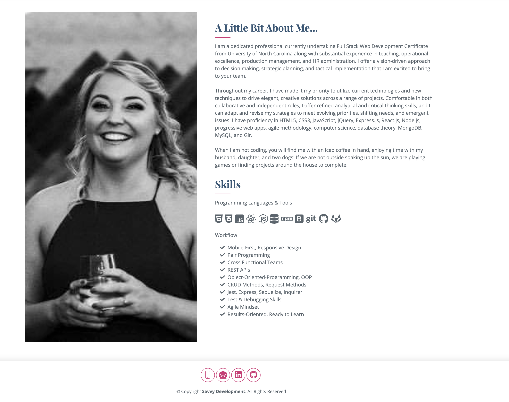
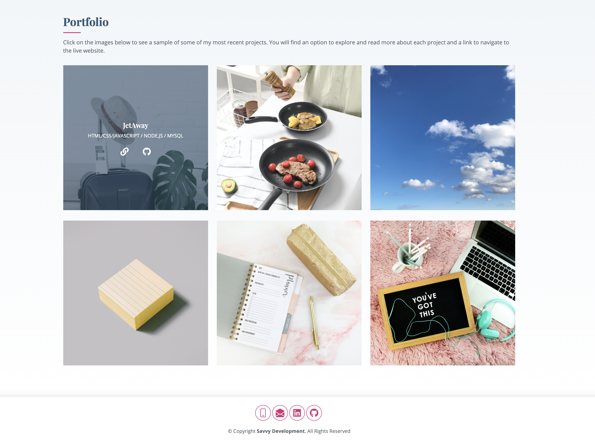
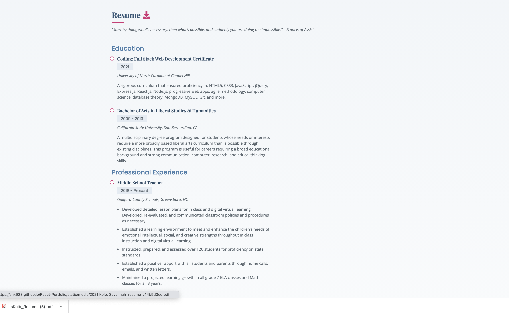
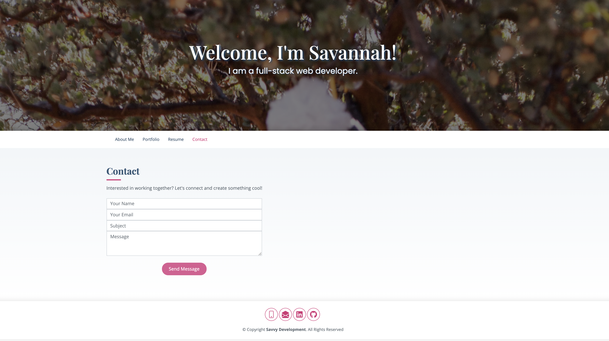

# Savannah Kolb REACT Portfolio
### updated 08/2021

## My Portfolio Presentation

This application is my personal REACT job portfolio. This will be used for any job searches or freelance work. It will give any potential clients or future employers a glimpse into who I am and what my work is like. You will find there is an about me section, a list of all my skills, recent projects, my resume, and contact information. 

Here is the link to my launched site: [Savannah Kolb React Portfolio](https://snk923.github.io/React-Portfolio/#contact)

### Homepage
#

When the user first enters my site, they will see a well polished and inviting header.

### About Me and Skills Section
#

Users will then be able to view my about me and skills section. You will see I have a responsive layout with the image and sections to allow users to view on any device. 

### Portfolio
#

Users can navigate to my portfolio section by clicking the navigation bar or by continuing to scroll down on their screen. They will see a grid (depending on screen size) of all my current and upcoming projects. When they hover on an image, they will see two options to click. The 'link'takes them to the live site and the 'github icon' takes them to m. 

### Resume 
#

Users can reference my resume right on my portfolio page or they have the option to download a pdf version by pressing the download button in the resume title.

### Contact 
#

Users can navigate to my contact section by clicking the navigation bar. Users will see a form they may fill out to contact me. In my footer across all pages they will see other ways to contace me as well. 

## Copyright
License: https://bootstrapmade.com/license/