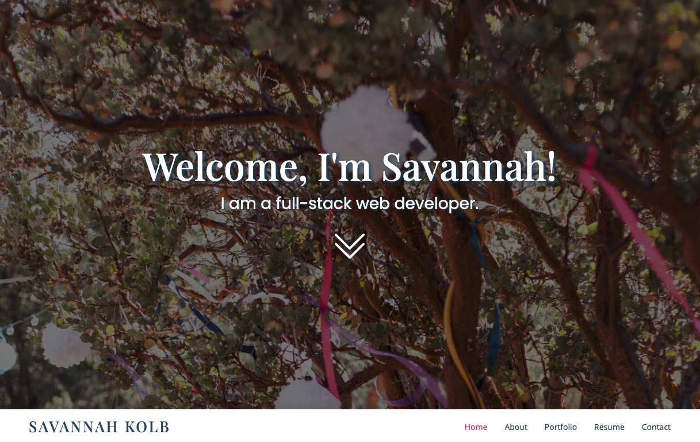
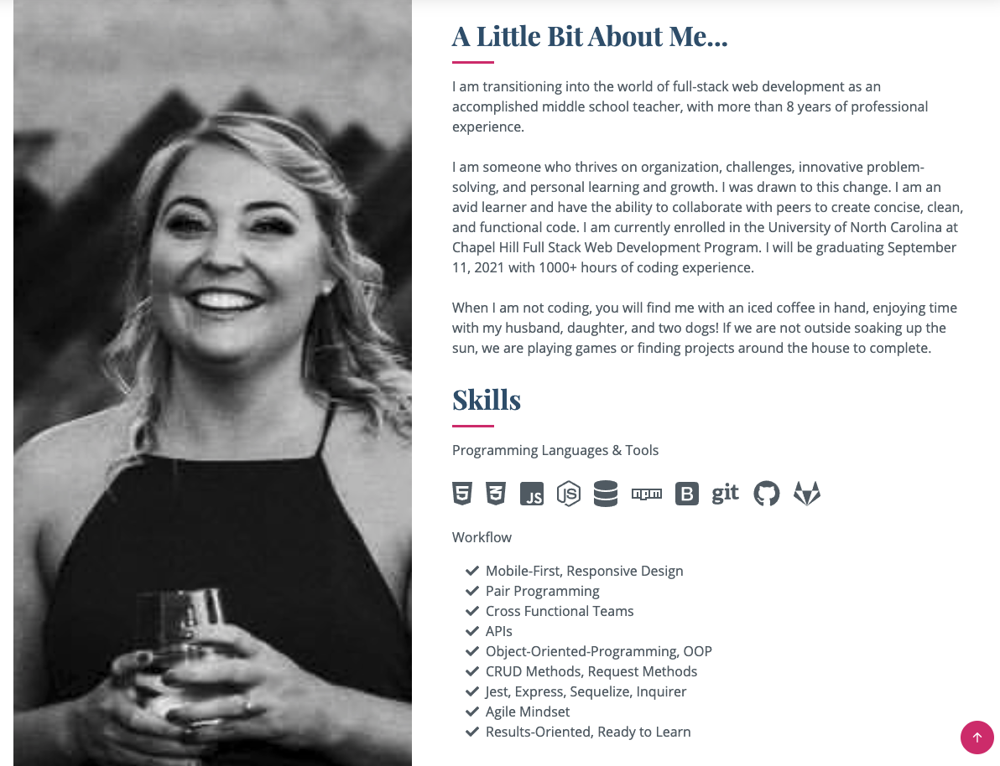
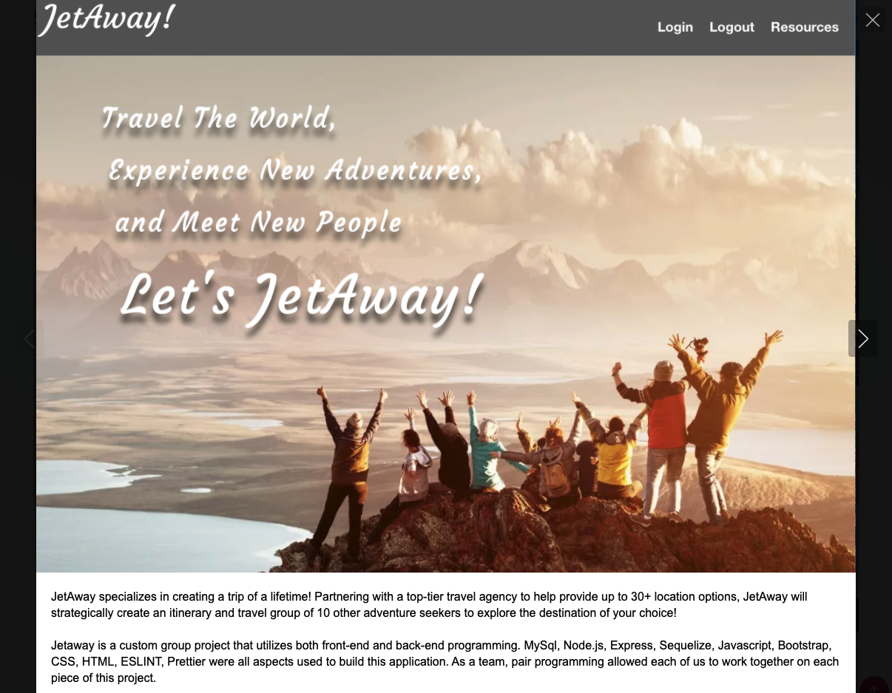

# Savannah Kolb Professional Portfolio
### updated 08/2021

## My Portfolio Presentation

This application is my personaly job portfolio. This will be used for any job searches or freelance work. It will give any potential clients or future employers a glimpse into who I am and what my work is like. You will find there is an about me section, a list of all my skills, recent projects, my resume, and contact information. 

Here is the link to my launched site: [Savannah Kolb Portfolio](https://www.savvykolb.com)

Here is the link to my original portfolio: [Outdated SK Portfolio](https://snk923.github.io/homework2-professional-portfolio/)

### Homepage
#

When the user first enters my site, they will see a well polished and inviting header. The user can scroll down by hitting the interavtice downward arrows. 

### About Me and Skills Section
#

Users will then be able to view my about me and skills section. You will see I have a responsive layout with the image and sections to allow users to view on any device. 

### Portfolio
#

Users can navigate to my portfolio section by clicking the navigation bar or by continuing to scroll down on their screen. They will see a grid (depending on screen size) of all my current and upcoming projects. When they click on an image, they will see the image dim and be given two choices to click. The 'plus' sign gives them more information on the project, the 'link' sign takes them to the live site. 

  

  

### Resume 
#

Users can reference my resume right on my portfolio page or they have the optin to download a pdf version by pressing the download button in the resume title.

### Contact 
#

Users can navigate to my portfolio section by clicking the navigation bar or by continuing to scroll down on their screen. Users will see multiple buttons for different ways to contact me.

## Copyright

Author: BootstrapMade.com
License: https://bootstrapmade.com/license/