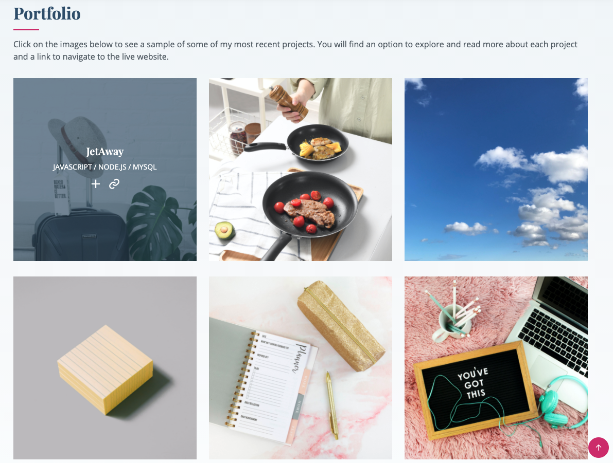

# 08 Project 1: Professional Materials

## My Task

Now that you've had some practice with APIs and have a project to share, you'll be updating your portfolio page and other materials to build toward being employer-competitive.

If you are opting out of career services, this is *still a required assignment*. Part of being a web developer means being a part of a community. Having a place to share your projects is *necessary* if you're applying for jobs, but it's also *critical* on your journey as a developer.

## The Acceptance Requirements I Met:

* Updated portfolio featuring Project 1 and two exemplary homework assignments.

* Updated GitHub profile with pinned repositories featuring Project 1 and two exemplary assignments.

* Updated resume

* Updated LinkedIn profile 

## My Portfolio Presentation

Here is the link to my launched site: [Savannah Kolb Portfolio](https://snk923.github.io/homework8-professional-materials/)

Here is the link to my original portfolio: [Outdated SK Portfolio](https://snk923.github.io/homework2-professional-portfolio/)

### Homepage
#

When the user first enters my site, they will see a well polished and inviting header. The user can scroll down by hitting the interavtice downward arrows. 

### About Me and Skills Section
#

Users will then be able to view my about me and skills section. You will see I have a responsive layout with the image and sections to allow users to view on any device. 

### Portfolio
#

Users can navigate to my portfolio section by clicking the navigation bar or by continuing to scroll down on their screen. They will see a grid (depending on screen size) of all my current and upcoming projects. When they click on an image, they will see the image dim and be given two choices to click. The 'plus' sign gives them more information on the project, the 'link' sign takes them to the live site. 

  

  

### Contact 
#

Users can navigate to my portfolio section by clicking the navigation bar or by continuing to scroll down on their screen. Users will see multiple buttons for different ways to contact me.

## Copyright

Author: BootstrapMade.com
License: https://bootstrapmade.com/license/